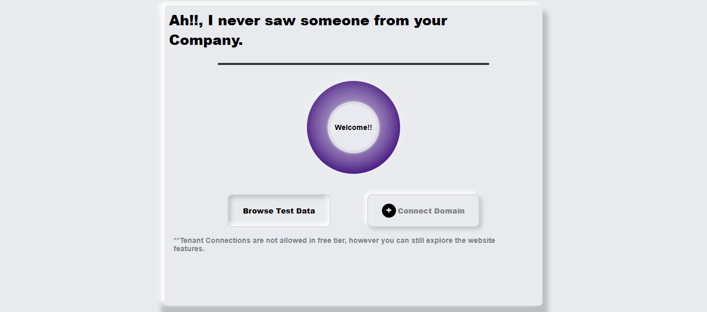

#  Animated card component

A sleek and interactive landing UI designed to greet users from unregistered companies. This project displays a professional, responsive card with animated elements and call-to-action buttons. Built using **React**, it includes custom styling and animation for enhanced UX.

---

## Preview



---

## Overview
This is a simple and aesthetic landing page which includes:

- A welcoming animated circular effect
- Two prominent buttons: 
  - **Browse Test Data**
  - **Connect Domain**
- A clean and responsive UI with neumorphic design principles
- An informative note about free-tier limitations

---

## Project Structure
```bash
vite-card/
├── node_modules/
├── public/
├── src/
│   ├── assets/
│   ├── component/
│   │   ├── buttons/
│   │   │   ├── Button.jsx
│   │   │   └── button.css
│   │   └── welcome_circle/
│   │       ├── Circle.jsx
│   │       └── circle.css
│   ├── App.jsx
│   ├── App.css
│   ├── index.css
│   ├── main.jsx
├── .gitignore
├── eslint.config.js
├── index.html
├── package-lock.json
├── package.json
├── README.md
├── vite.config.js

```

---

## Getting Started

### Pre-requisites

Ensure you have the following installed:

- [Node.js](https://nodejs.org/)
- [npm](https://www.npmjs.com/) 

### Installation

1. **Clone the repository:**

```bash
git clone https://github.com/KanakGupta1208/assessment.git
cd assessment
```

2. **Install dependencies:**

```bash
npm install
```

3. **Start the development server:**

```bash
npm run dev
```

4. **Open in Browser:**
Go to http://localhost:port/ to view the card.

## Card Implementation 

### Animated Welcome Circle
A circular gradient animation runs continuously using React's `useEffect` and trigonometric calculations to simulate orbit-like motion.

###  Buttons
Includes both primary and secondary button styles using `flexbox`, custom shadows, and hover effects. The **Connect Domain** button features an inline `+` icon inside a circle.

### UI/UX Design
Uses neumorphism and modern design cues (soft shadows, rounded cards, blur effects) for a polished feel.

---

## Dependencies

- **React** – Core library for building UI
- **CSS Modules** – For component-specific styling
- **Custom CSS** – For neumorphic effects and animations

---

## Challenges Faced

### Circular Animation
Creating smooth, continuous animation without external libraries required precise angle-based calculation using `Math.sin()` and `Math.cos()` within an interval loop.

### UI Consistency
Ensuring consistent neumorphic design across all screen sizes took careful tuning of margins, shadows, and layout alignment.

---

Built with passion using **React** & **Pure CSS**


